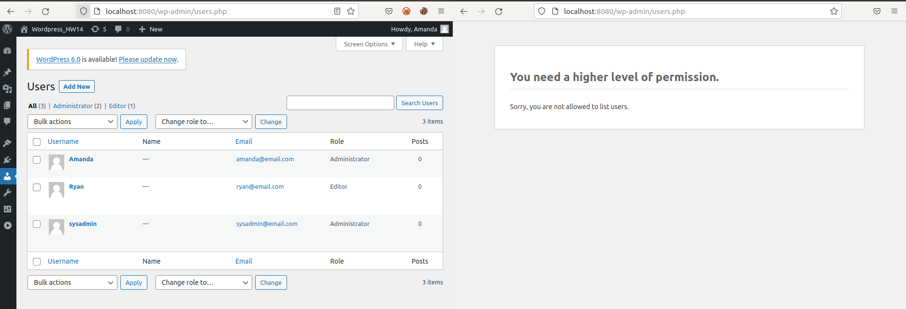
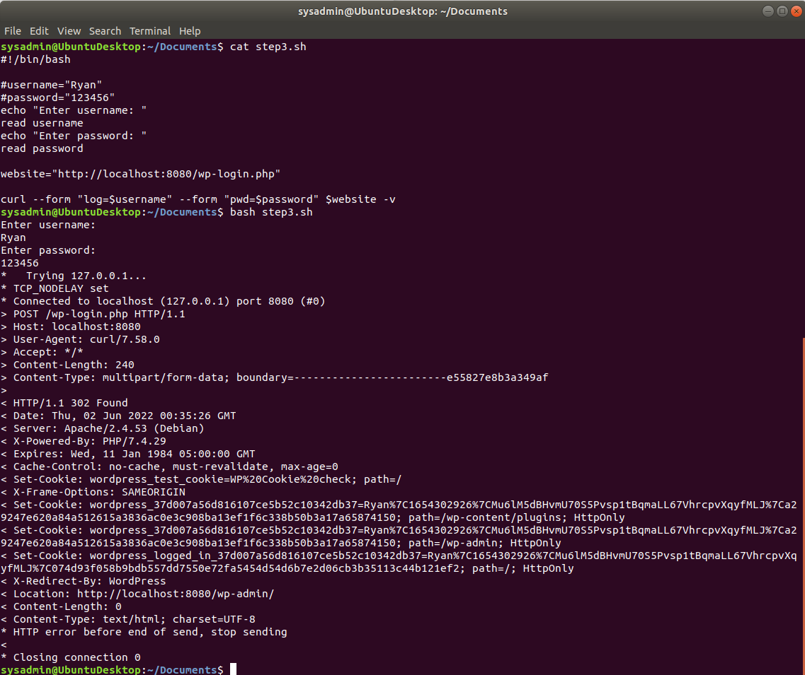
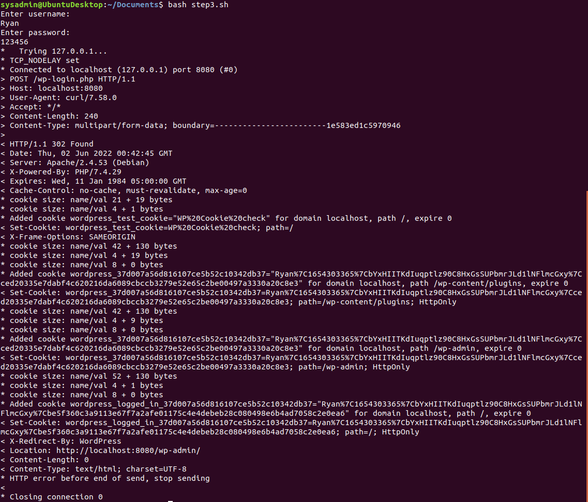
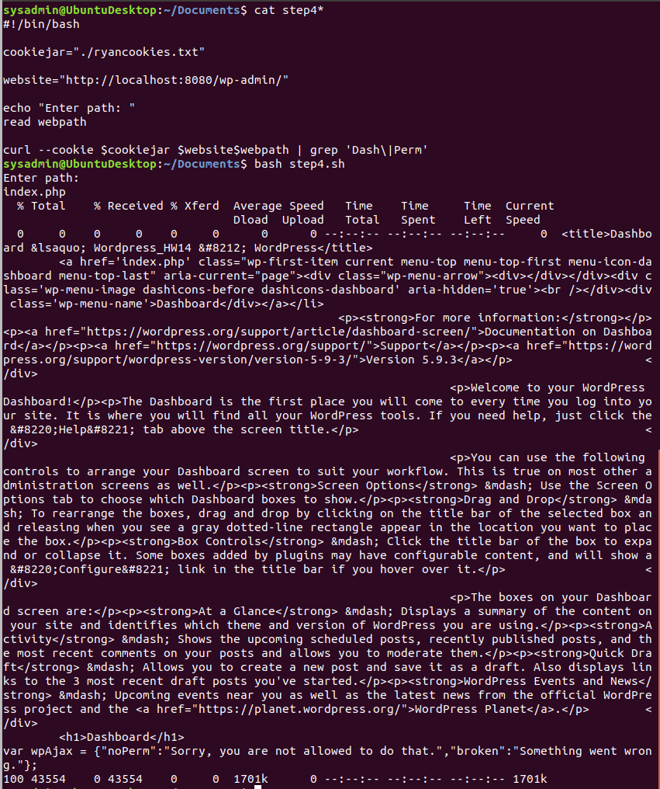

## Week 14 Homework: Web Development

### Questions 

#### HTTP Requests and Responses

Answer the following questions about the HTTP request and response process.

1. What type of architecture does the HTTP request and response process occur in?
    - The HTTP request and respnse process occur in Client-Server architecture type.

2. What are the different parts of an HTTP request? 
    - The different parts of an HTTP request are composed of a request line, header, and request body.

3. Which part of an HTTP request is optional?
    - The request body is the part of an HTTP request that is optional.

4. What are the three parts of an HTTP response?
    - The three main parts of an HTTP response is a status line, header, and response body.

5. Which number class of status codes represents errors?
    - The 400 and 500 status codes represents errors, client and server side, respectfully.

6. What are the two most common request methods that a security professional will encounter?
    - POST and GET methods are the two most common request mothods that asecurity professional will encounter.

7. Which type of HTTP request method is used for sending data?
    - A POST request is a type of HTTP request method that is used for sending data.

8. Which part of an HTTP request contains the data being sent to the server?
    - The request body is a part of an HTTP request that contains the data being sent to the server.

9. In which part of an HTTP response does the browser receive the web code to generate and style a web page?
    - The response body is a part of an HTTP response that the browser recieves the web code so it can generate and style a web page.

#### Using curl

Answer the following questions about `curl`:

10. What are the advantages of using `curl` over the browser?
    - The advantages of using curl over the browser is that it can be more precise and specific when it comes to testing HTTP request and as well having a potential for automating these tests.

11. Which `curl` option is used to change the request method?
    - `-X` option is used to change the request method

12. Which `curl` option is used to set request headers?
    - `-H` option is used to set the request headers.

13. Which `curl` option is used to view the response header?
    - `-I` option is used to view the response header.

14. Which request method might an attacker use to figure out which HTTP requests an HTTP server will accept?
    - The `OPTIONS` request method may be used by an attacker to figure out which requests method an HTTP server will accept.  
#### Sessions and Cookies

Recall that HTTP servers need to be able to recognize clients from one another. They do this through sessions and cookies.

Answer the following questions about sessions and cookies:

15. Which response header sends a cookie to the client?

    ```HTTP
    HTTP/1.1 200 OK
    Content-type: text/html
    Set-Cookie: cart=Bob
    ```
    - `Set-Cookie` is the response header that sends a cookie to the client.

16. Which request header will continue the client's session?

    ```HTTP
    GET /cart HTTP/1.1
    Host: www.example.org
    Cookie: cart=Bob
    ```
    - `Cookie` is the request header that will continue the client's session.

#### Example HTTP Requests and Responses

Look through the following example HTTP request and response and answer the following questions:

**HTTP Request**

```HTTP
POST /login.php HTTP/1.1
Host: example.com
Accept-Encoding: gzip, deflate, br
Connection: keep-alive
Content-Type: application/x-www-form-urlencoded
Content-Length: 34
Upgrade-Insecure-Requests: 1
User-Agent: Mozilla/5.0 (Linux; Android 6.0; Nexus 5 Build/MRA58N) AppleWebKit/537.36 (KHTML, like Gecko) Chrome/80.0.3987.132 Mobile Safari/537.36

username=Barbara&password=password
```

17. What is the request method?
    - `POST` is the request method.

18. Which header expresses the client's preference for an encrypted response?
    - `Accept-Encoding` is the header that expresses the client's preference for an encrypted response.

19. Does the request have a user session associated with it?
    - No, the request does not have a user session associated with it.

20. What kind of data is being sent from this request body?
    - The kind of data that is being sent from this request body are `login credentials`

**HTTP Response**

```HTTP
HTTP/1.1 200 OK
Date: Mon, 16 Mar 2020 17:05:43 GMT
Last-Modified: Sat, 01 Feb 2020 00:00:00 GMT
Content-Encoding: gzip
Expires: Fri, 01 May 2020 00:00:00 GMT
Server: Apache
Set-Cookie: SessionID=5
Content-Type: text/html; charset=UTF-8
Strict-Transport-Security: max-age=31536000; includeSubDomains
X-Content-Type: NoSniff
X-Frame-Options: DENY
X-XSS-Protection: 1; mode=block

[page content]
```

21. What is the response status code?
    - status code `200`

22. What web server is handling this HTTP response?
    - `Apache` web server is handling the HTTP response

23. Does this response have a user session associated to it?
    - Yes, this response has a user seesion associated to it.

24. What kind of content is likely to be in the [page content] response body?
    - `Text` or `HTML` is likely to be in the [page content] response body.

25. If your class covered security headers, what security request headers have been included?
    - The Strict-Transport-Security header should have been included.

#### Monoliths and Microservices

Answer the following questions about monoliths and microservices:

26. What are the individual components of microservices called?
    - Front-end, back-end, and database.

27. What is a service that writes to a database and communicates to other services?
    - Back-end service writes to a database and communicates to other services.

28. What type of underlying technology allows for microservices to become scalable and have redundancy?
    - Containerization is a type of underlying technology that allows for microservices to become scalable and have redundancy.

#### Deploying and Testing a Container Set

Answer the following questions about multi-container deployment:

29. What tool can be used to deploy multiple containers at once?
    - Depending on the scope, using Docker, you are able to deploy multiple containers at once in a given server. Ansible can do the same thing in a much larger scale of deployment throughout mulitple servers that may need to have different sets of configurations. There is also, but not limited to, Kubernetes, that can go much farther than just deploying but also managing clusters of containers through a preference called an orchestration.

30. What kind of file format is required for us to deploy a container set?
    - A `YML` or `Yet Another Markup Language` format is required for us to deploy a container set (if using Ansible).

#### Databases

31. Which type of SQL query would we use to see all of the information within a table called `customers`?
    ```
    SELECT * FROM `customers`;
    ```

32. Which type of SQL query would we use to enter new data into a table? (You don't need a full query, just the first part of the statement.)
    - `INSERT INTO`

33. Why would we never run `DELETE FROM <table-name>;` by itself?
    - It will delete the whole table.

---

### Bonus Challenge Instructions: The Cookie Jar

#### Step 1: Set Up

Create two new users: Amanda and Ryan.   


#### Step 2: Baselining

For these "baselining" steps, you'll want to log into two different types of accounts to see how the WordPress site looks at the `localhost:8080/wp-admin/users.php` page.  We want to see how the Users page looks from the perspective of an administrator, vs. a regular user.



#### Step 3: Using Forms and a Cookie Jar

Navigate to `~/Documents` in a terminal to save your cookies.

1. Construct a `curl` request that enters two forms: `"log={username}"` and `"pwd={password}"` and goes to `http://localhost:8080/wp-login.php`. Enter Ryan's credentials where there are placeholders.

    - **Question:** Did you see any obvious confirmation of a login? (Y/N)
        - Yes

    


2. Construct the same `curl` request, but this time add the option and path to save your cookie: `--cookie-jar ./ryancookies.txt`. This option tells `curl` to save the cookies to the `ryancookies.txt` text file.

    
    

3. Read the contents of the `ryancookies.txt` file.

    

   - **Question:** How many items exist in this file?
        - 3

Note that each one of these is a cookie that was granted to Ryan after logging in.

#### Step 4: Log in Using Cookies

1. Craft a new `curl` command that now uses the `--cookie` option, followed by the path to your cookies file. For the URL, use `http://localhost:8080/wp-admin/index.php`.

   - **Question:** Is it obvious that we can access the Dashboard? (Y/N)
        - Not right away but a bit of reading you can see that the Dashboard is accessible.

2. Press the up arrow on your keyboard to run the same command, but this time, pipe `| grep Dashboard` to the end of your command to return all instances of the word `Dashboard` on the page.

    - **Question:**  Look through the output where `Dashboard` is highlighted. Does any of the wording on this page seem familiar? (Y/N) If so, you should be successfully logged in to your Editor's dashboard.
        - Yes

    

#### Step 5: Test the Users.php Page

1. Finally, write a `curl` command using the same `--cookie ryancookies.txt` option, but attempt to access `http://localhost:8080/wp-admin/users.php`.

    - **Question:** What happens this time?
        - It shows a similar page to when a user requires a higher permission to view a page.

    
