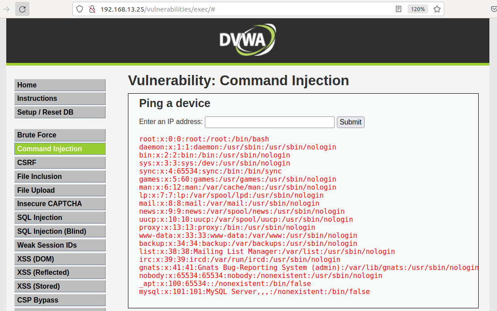
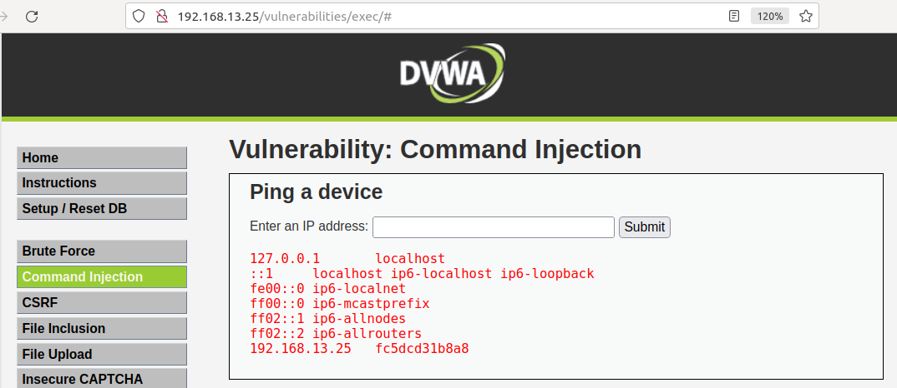
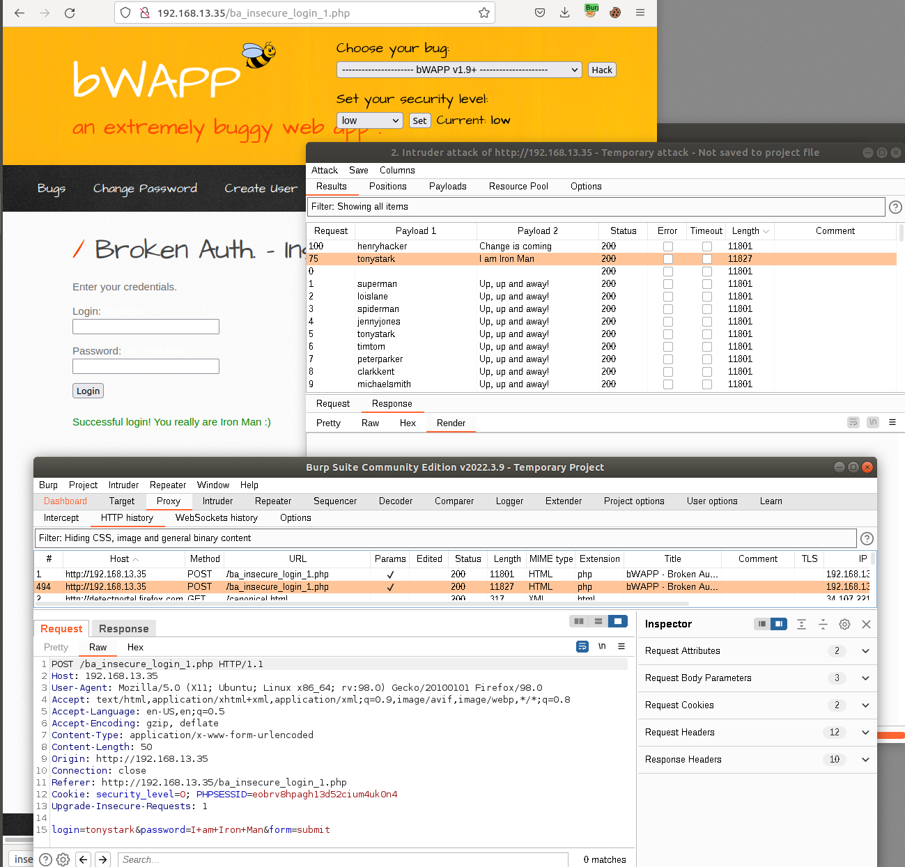
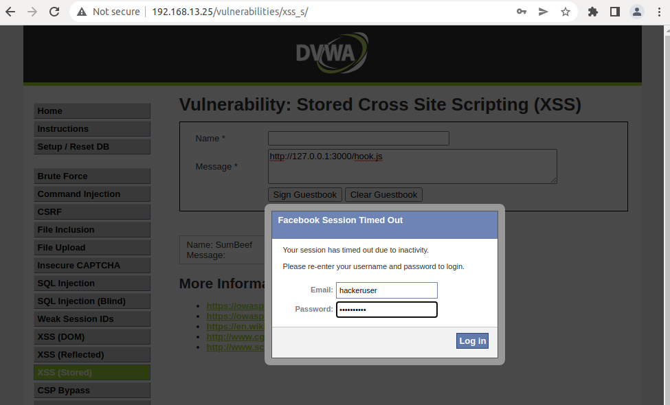
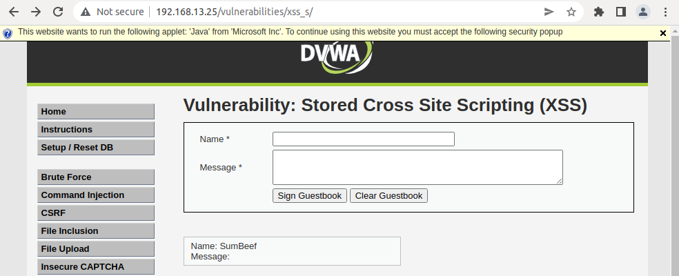
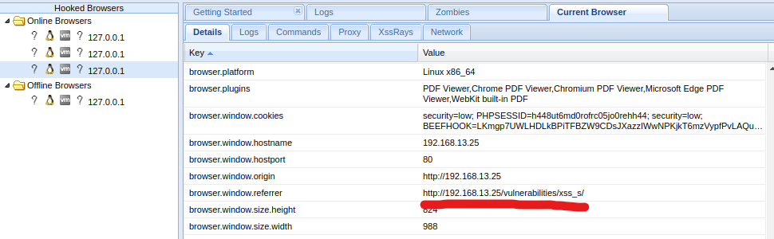

# Unit 15 Homework

### Web Application 1: *Your Wish is My Command Injection*

  **Deliverable**: Take a screen shot confirming that this exploit was successfully executed and provide 2-3 sentences outlining mitigation strategies. 

  
  

  - A few possible mitigation strategy for a user having an interactive access to the CLI with a POST method would be the use of a hybrid solution (client and server side filter). For both the server and client side, we could have the server output only the necessary data in case there is still a hole in the solution at least the end user will not be able to see a unnecessary data coming from the server. Having a scripted or embedded filter for the input bar to only accept numbers and a limited amount of periods and/or characters should decrease the amount of laymen from playing around with the form. As for the server side, we could set it to where it filters out the unnecessary parts of the data sent before executing the command with the string sent.

### Web Application 2: *A Brute Force to Be Reckoned With*

  **Deliverable**: Take a screen shot confirming that this exploit was successfully executed and provide 2-3 sentences outlining mitigation strategies. 

  

  - Using ssl (HTTPS) is one way of having the user data encrypted in another scope of a secure login. But a main way of preventing a brute force attack is having a set limit of how many tries a user can attempt to log in to their account before it gets locked. This is a server-side solution, and can also be combined with a CAPTCHA to decrease automation attempts.

### Web Application 3: *Where's the BeEF?*

  **Deliverable**: Take a screen shot confirming that this exploit was successfully executed and provide 2-3 sentences outlining mitigation strategies. 

  
  
  

  - A user input should go through sanitation techniques when it goes in any way of client and server so that the script that may hook a web browser may come through from any direction but wont be ran and be seen as plain text or just be removed entirely. 
    
---
